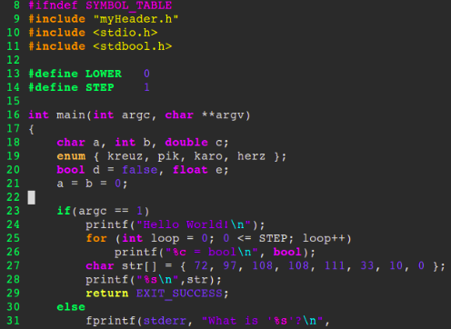
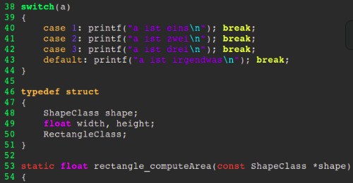

# heman

The **heman** theme is inspired by
the 90es rainbow color palette.
I did search for a heman color theme
for _vim_ and could never find one.

## screenshots

# NOTE:
Currently **only** supports C!
