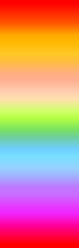

  
# heman

The **heman** theme is inspired by
the 90es rainbow color palette.
I did search for a heman color theme
for _vim_ and could not find one, so i decided to make one!

## screenshots

#### C

#### ruby

#### css

## color table

 

# FULL support for:
+ **C**
+ ruby
+ css
